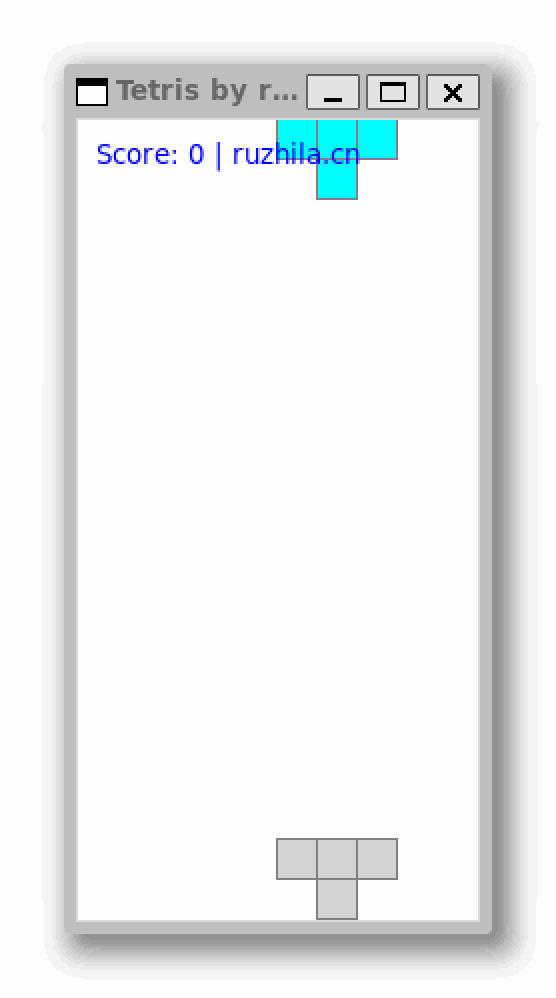

# A tetris game using tkinter/awt, 100 lines python/java code

By [ruzhila.cn](http://ruzhila.cn/?from=github_tetris), a campus for learning backend development through practice.

### 🚀 [100-line-code](https://github.com/ruzhila/100-line-code)  A collection of learning projects written in 100 lines of code 

This is a tutorial code demonstrating how to use Python/Java write game. Pull requests are welcome. 👏

## Python version
```bash
python3 tetris.py
```


## Java version
```bash
javac Tetris.java
java Tetris
```
